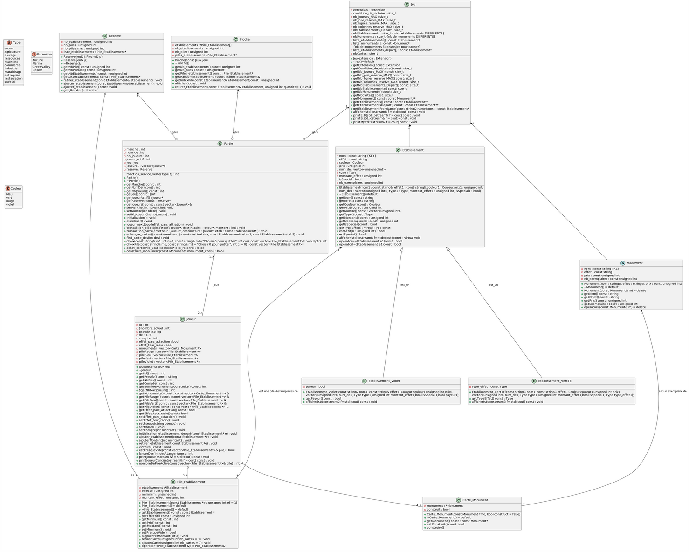

# LO21 - Projet Machi Koro

Ce dépôt contient le code source et les documents relatifs au projet "Machi Koro" réalisé dans le cadre de l'UV LO21 à l'Université de Technologie de Compiègne (UTC) durant l'année universitaire 2022-2023.

## Description du projet

Machi Koro est un jeu de société japonais créé par Masao Suganuma, édité en France sous le nom "Minivilles". Ce projet avait pour but de comprendre et d’appréhender les concepts de la programmation orientée objet en utilisant le langage C++. Nous avons conçu une architecture modulable et réutilisable, capable de s’adapter aux différentes extensions du jeu.

### Fonctionnalités principales

- **Jeu de base** : Partie standard de 2 à 4 joueurs (ou plus, selon l’édition).
- **IA** : Simulation de joueurs virtuels.
- **Extensions** : Possibilité de jouer avec différentes éditions du jeu, y compris Marina, Green Valley, et Deluxe.
- **Interface graphique** : Interface utilisateur développée avec QT.

## Architecture

Le projet suit une architecture orientée objet, avec les classes principales suivantes :

- `Partie` : Gère l'initialisation et le déroulement de la partie.
- `Jeu` : Contient les données constantes telles que les extensions et les cartes.
- `Joueur` : Gère les cartes et monuments appartenant à un joueur.
- `Etablissement` et `Monument` : Représentent les différents types de cartes.
- `Pioche` et `Réserve` : Gèrent les cartes disponibles pour les joueurs.

### Diagramme de classes



## Dépendances

- **C++** : Langage de programmation principal.
- **QT** : Utilisé pour l'interface graphique.
- **SQLite** : Utilisé pour la gestion des cartes dans une base de données.

## Installation

1. Clonez le dépôt :
    ```bash
    git clone https://github.com/votre-utilisateur/lo21-projet-machi-koro.git
    ```

2. Accédez au répertoire du projet :
    ```bash
    cd lo21-projet-machi-koro
    ```

3. Compilez le projet :
    ```bash
    qmake
    make
    ```

## Utilisation

Exécutez l'application compilée pour lancer le jeu avec l'interface graphique QT. Vous pouvez choisir de jouer avec des joueurs humains ou contre l'IA, et sélectionner différentes extensions du jeu.

## Contribution

Les contributions sont les bienvenues ! Veuillez soumettre une pull request ou ouvrir une issue pour discuter des changements que vous souhaitez apporter.

### Membres du projet

- Gabrielle van de Vijver
- Tobias Savary
- Joséphine Lapié
- Jingfang Yuan

## Licence

Ce projet est sous licence MIT. Voir le fichier [LICENSE](LICENSE) pour plus de détails.

## Remerciements

Merci à l'Université de Technologie de Compiègne pour le soutien et les ressources fournies tout au long de ce projet.

